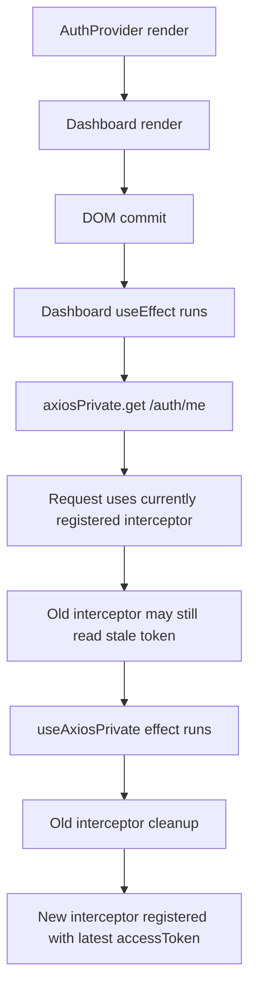
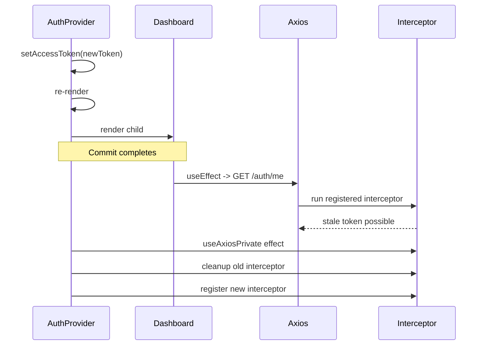
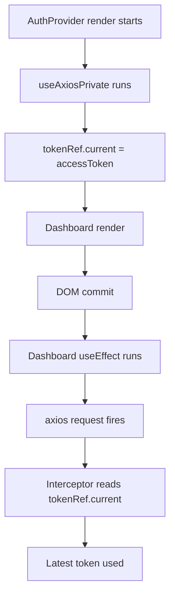

# Render Order vs Effect Order in React Auth Flows

This note shows why an axios interceptor that is recreated in `useEffect` can
race with a child component request after an auth token is restored.

## Render vs Effect

```text
COMPONENT TREE
AuthProvider
└── Dashboard


1. RENDER PHASE  (top-down)
────────────────────────────────────
AuthProvider render
   ↓
Dashboard render


2. COMMIT PHASE
────────────────────────────────────
DOM updates committed


3. EFFECT PHASE  (bottom-up for useEffect)
────────────────────────────────────
Dashboard useEffect
   ↓
useAxiosPrivate / AuthProvider useEffect
```

Compact mental model:

```text
Render          : Parent -> Child
useLayoutEffect : Child -> Parent
useEffect       : Child -> Parent
```

## Interceptor Recreation Race

```text
restoreSession()
   ↓
setAccessToken(newToken)
setUser(user)
setLoading(false)
   ↓
React re-render starts

RENDER ORDER
────────────
AuthProvider render
   ↓
Dashboard render
   ↓
Dashboard is now mounted

EFFECT ORDER
────────────
Dashboard useEffect runs first
   ↓
axiosPrivate.get('/auth/me') fires
   ↓
OLD interceptor / stale token may still be active

THEN
useAxiosPrivate effect runs
   ↓
old interceptor cleanup
   ↓
new interceptor registered with new accessToken
```





## Ref-Based Flow

Keeping the interceptor stable and reading the latest token from a ref removes
the interceptor recreation window.

```text
render starts
   ↓
useAxiosPrivate() runs
   ↓
tokenRef.current = accessToken   <- synchronous during render
   ↓
Dashboard render
   ↓
commit
   ↓
Dashboard useEffect runs
   ↓
axios request fires
   ↓
interceptor reads tokenRef.current
   ↓
latest token used
```



## Takeaway

```text
Recreating interceptor in useEffect = can race
Reading latest token from ref       = no recreation race
```

## References

- [Render and effect call order in React](https://www.seanmcp.com/articles/render-and-effect-call-order-in-react/)
- [React parent and child useEffect execution order](https://stackoverflow.com/questions/58352375/what-is-the-correct-order-of-execution-of-useeffect-in-react-parent-and-child-co)
- [Beware of React useEffect race condition bugs](https://joel.net/beware-of-reactuseeffect-race-condition-bugs)
- [How to fix stale closures in React hooks](https://coreui.io/answers/how-to-fix-stale-closures-in-react-hooks/)
